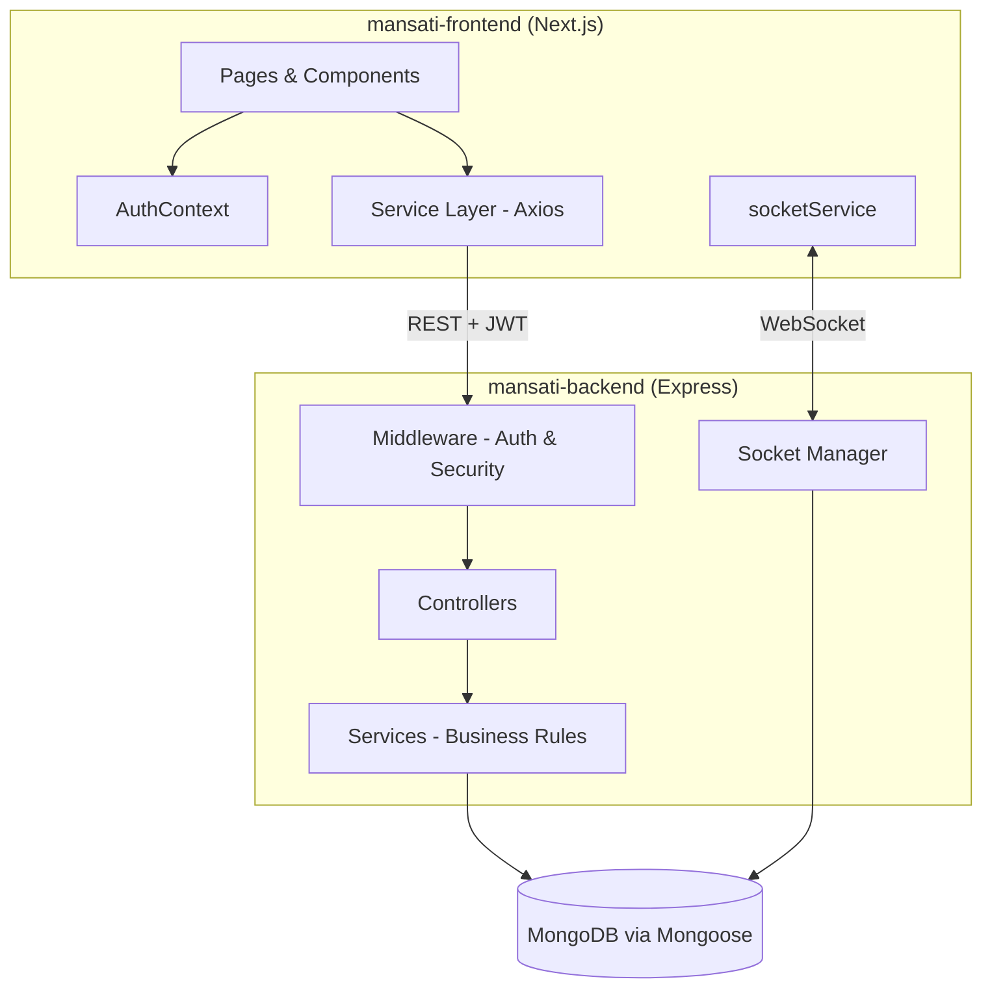
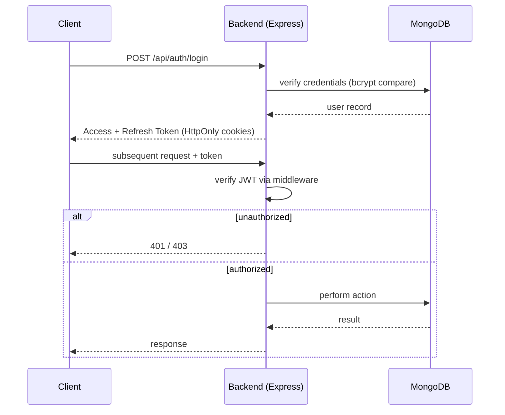
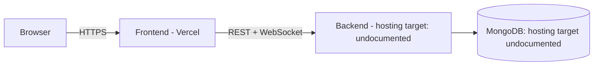

<div align="center">

# منصتي — Mansati

### An Arabic-native social platform, built API-first with a real-time core.


[Frontend Repository](https://github.com/mohammed-dev-stack/mansati-frontend) · [Backend Repository](https://github.com/mohammed-dev-stack/mansati-backend)

</div>

---

> **A note on repository structure, up front:** Mansati is shipped as **two separate repositories** — `mansati-frontend` (Next.js) and `mansati-backend` (Express/MongoDB) — that reference each other, rather than a single monorepo. This document is a product-level index over both. Anywhere infrastructure, Docker, or CI/CD would normally be described, the honest answer is **insufficient evidence from repository** — neither sub-repo's documentation shows a Dockerfile, compose file, or pipeline config. That's called out explicitly below instead of guessed at.

---

## Product Overview

Mansati (منصتي, "my platform") is a full social-networking product for Arabic-speaking users: profiles, a following graph, a reaction-and-comment post feed, private real-time messaging, live notifications, and content sharing — paired with a genuinely separate admin console for platform operators (user/content moderation, messaging oversight, analytics, system health).

It's split cleanly along a client/server line: a Next.js frontend that owns UI, routing, and client-side real-time handling, talking over REST (Axios) and WebSocket (Socket.IO) to an Express/MongoDB backend that owns persistence, identity, and the authoritative real-time event bus.

## Business Value

- **Arabic and RTL as the default, not a locale bolt-on.** The frontend's layout, typography, and component set are built RTL-first — a meaningfully different starting point than adapting an LTR product after the fact, for any product targeting Arabic-speaking markets.
- **A working moderation surface from day one.** The admin console (user/post/message moderation, role management, analytics, system health) means the product isn't just a consumer app with no operational lever — there's a documented path for a team to actually run the platform.
- **Real-time is core, not bolted on.** Messaging and notifications are built on Socket.IO end-to-end (client `socketService` ↔ backend `socket/` manager), not simulated via polling — which matters for perceived product quality in a chat-and-social context.

## Technical Value

- **Layered backend architecture** (routes → middleware → controllers → services → data layer) keeps business logic out of route handlers, which is the difference between a backend that's demoable and one that's maintainable past the first few features.
- **Typed, service-oriented frontend** — a dedicated `services/` layer per domain (posts, follows, messages, notifications, admin, users, sockets) sitting behind custom hooks, so UI components never talk to HTTP/WebSocket transport directly.
- **JWT dual-token auth** (access + refresh) issued by the backend, with route-level and role-level gating on both sides — the frontend gates navigation, the backend is the actual authority.
- **A documented redirect pattern for post permalinks** (`/posts/[id]` → `/posts?highlight=id`) rather than a duplicated detail-page implementation — a small but telling sign of a team optimizing for one source of truth over easy-looking shortcuts.

---

## System Architecture



Two independently deployable services, joined by a typed HTTP contract and a live WebSocket channel — no shared runtime, no shared database access from the client.

## Repository Structure

```
mansati-frontend/          (separate repository)
├── src/app/                # Next.js App Router: auth, admin, posts, messages, profile, users
├── src/components/         # Feature-organized: posts, users, messages, notifications, admin, layout
├── src/context/            # AuthContext
├── src/hooks/               # useAuth, usePosts, useProfile
├── src/services/            # api.ts + one service module per domain
├── src/types/                # Admin, Message, Notification, Post, User
└── src/utils/, src/styles/

mansati-backend/            (separate repository)
├── config/                   # DB connection & CORS
├── controllers/              # Request-handling logic
├── middleware/                # Auth, authorization, error handling
├── models/                    # Mongoose schemas
├── routes/                    # API endpoint definitions
├── socket/                     # WebSocket event management
├── utils/
└── server.js                  # Entry point
```

Insufficient evidence from repository for: a shared root directory, workspace/monorepo tooling (e.g., Turborepo, Nx, npm workspaces), or any file that ties both repos together beyond the README cross-links.

## Frontend Overview

Next.js 15 (App Router) + React 19 + TypeScript. Route groups separate unauthenticated flows (`(auth)`), the admin console (`admin/`, its own layout), and the core app (feed, messaging, profiles, user discovery). State is Context (`AuthContext`) plus feature hooks rather than a global store; a dedicated service layer centralizes all HTTP (Axios, with token-attach/refresh interceptors) and WebSocket (`socketService`) access. Full detail: [`mansati-frontend` README](https://github.com/mohammed-dev-stack/mansati-frontend).

## Backend Overview

Node.js/Express, layered architecture (routes → middleware → controllers → services → MongoDB via Mongoose). Confirmed capabilities: JWT dual-token auth (access + refresh, HttpOnly cookies), Bcrypt password hashing, Helmet security headers, rate limiting, data sanitization, centralized error handling, Multer file uploads, and a Socket.IO manager for real-time events. Only 5 endpoints are documented at source (`/api/auth/register`, `/api/auth/login`, `/api/posts`, `/api/messages`, `/api/admin/stats`) — treat this as a confirmed subset, not the full API surface. Full detail: [`mansati-backend` README](https://github.com/mohammed-dev-stack/mansati-backend).

---

## Security Overview



Confirmed controls, split by which side owns them:

| Concern | Owner | Mechanism |
|---|---|---|
| Password storage | Backend | Bcrypt hashing |
| Session tokens | Backend (issues) / Frontend (attaches) | JWT access + refresh, HttpOnly cookies |
| HTTP security headers | Backend | Helmet.js |
| Brute-force / flood protection | Backend | Rate limiting (thresholds not documented) |
| Injection protection | Backend | Data sanitization (NoSQL injection) |
| Route/role gating | Both | Backend middleware is authoritative; frontend also gates navigation |
| Client-side input/URL sanitization | Frontend | `sanitizeInput`, `sanitizeImageUrl` utilities |

**Known documentation conflict**: the frontend's own docs describe token storage two ways (HttpOnly cookie in one section, `sessionStorage` in another). This should be resolved against the actual `Set-Cookie` behavior and the frontend's Axios interceptor before being stated as fact in either sub-repo's docs.

## Scalability Overview

The stack (stateless JWT auth, MongoDB, Socket.IO) is *compatible* with horizontal scaling in principle, but **insufficient evidence from repository** exists for: a Socket.IO multi-instance adapter (e.g., Redis pub/sub — required once you run more than one backend process, since raw Socket.IO doesn't fan out across instances on its own), database indexing strategy, caching layer, containerization, or load-test results. This is a real gap for a product with live chat as a core feature, not a cosmetic one — it's the first thing to validate before scaling backend instances horizontally.

---

## Development Workflow

Each repository is developed and run independently:

```bash
# Backend
git clone https://github.com/mohammed-dev-stack/mansati-backend.git
cd mansati-backend && npm install
cp .env.example .env   # set MongoDB URI and required secrets
npm run dev             # http://localhost:5000

# Frontend
git clone https://github.com/mohammed-dev-stack/mansati-frontend.git
cd mansati-frontend && npm install
# .env.local: NEXT_PUBLIC_API_URL / NEXT_PUBLIC_SOCKET_URL → http://localhost:5000
npm run dev              # http://localhost:3000
```

The backend must be running before the frontend, since auth, feed, and real-time features all depend on a live API — there's no mock/offline mode documented.

## Local Setup

See per-repo setup above. There is no documented single-command bootstrap (e.g., a root `docker-compose up` or a setup script spanning both repos) — **insufficient evidence from repository** for any orchestration tooling beyond running `npm run dev` in each repo separately.

## Deployment Architecture

Confirmed: the frontend has a live preview hosted on **Vercel**, a natural fit for a Next.js App Router app (zero-config SSR, automatic deploys). **Insufficient evidence from repository** for the backend's deployment target — no Dockerfile, hosting platform, or CI/CD pipeline is documented for `mansati-backend`. Given it's a stateful Node/Express process with WebSocket connections, it is not deployable as-is to a pure serverless/edge target the way the frontend is — it needs a persistent process host and a reachable MongoDB instance (Atlas or self-hosted).



## Documentation

- [Frontend README](https://github.com/mohammed-dev-stack/mansati-frontend) — UI architecture, routing, component structure, frontend security.
- [Backend README](https://github.com/mohammed-dev-stack/mansati-backend) — layered architecture, auth flow, tech stack, folder structure.
- No API reference (OpenAPI/Swagger), architecture decision records (ADRs), or contribution guide beyond the frontend repo's basic PR steps were found in the provided material.

## Roadmap

Aggregated from both repos' own stated future-work items — not a claim of a unified product roadmap, since none was documented as such:

- [ ] Groups (public/private, membership, in-group posts)
- [ ] Advanced search (date, media type, engagement)
- [ ] Web Push notifications
- [ ] Dark mode
- [ ] WebP image pipeline
- [ ] Automated testing (Jest, Cypress) and CI
- [ ] Storybook component documentation
- [ ] Formal accessibility pass (ARIA, keyboard navigation)
- [ ] Live streaming (WebRTC)
- [ ] Hashtag system
- [ ] Full OpenAPI documentation for the backend
- [ ] Structured backend logging and a health/monitoring endpoint
- [ ] Redis-backed Socket.IO adapter for horizontal scaling
- [ ] Resolve the frontend token-storage documentation conflict

## Contributing

The frontend repo documents a standard flow: fork → feature branch → implement with tests where possible → push → open a PR with a clear description, following existing ESLint/Prettier conventions and the established feature-folder component pattern. No contribution guide was found for the backend repo specifically — apply the same conventions until one exists.

## License

Both repositories are documented as **MIT licensed**.

## Author

**Mohammed Qannan**
Full-Stack Developer — Next.js, React, TypeScript on the client; Node.js, Express, and MongoDB on the server. Built and documented both halves of Mansati independently.
