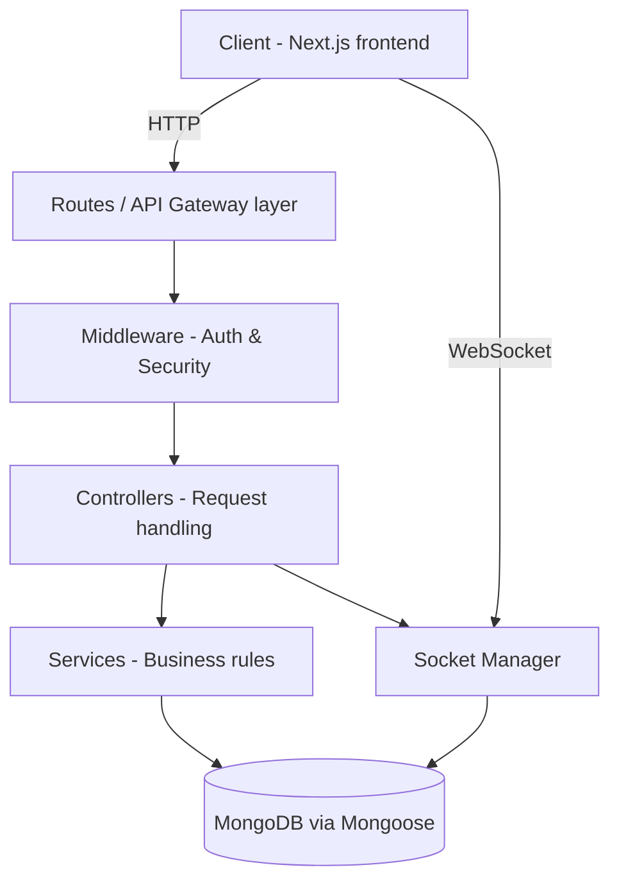
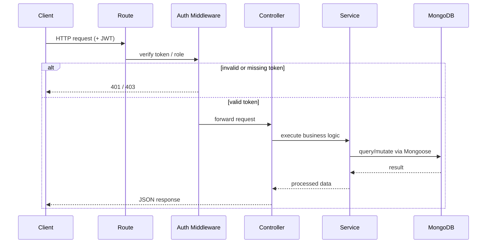
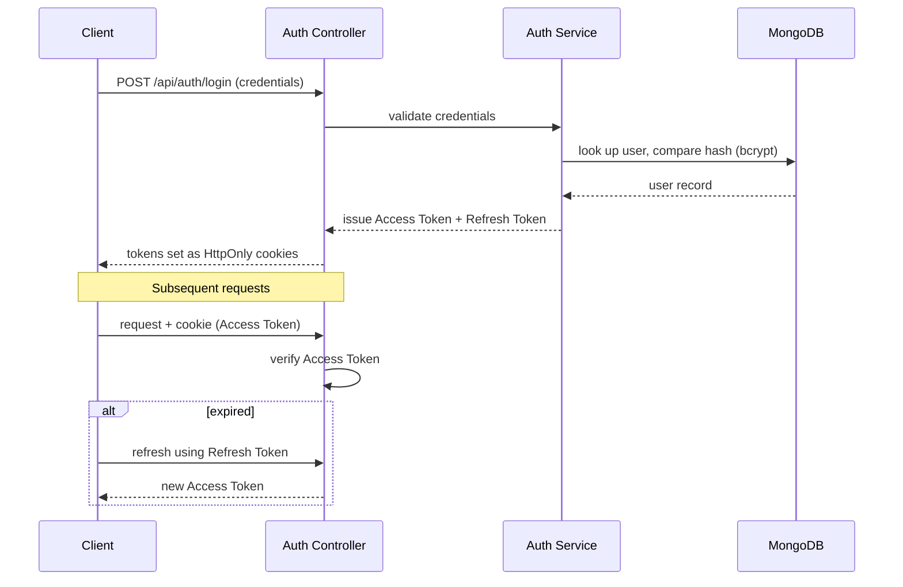
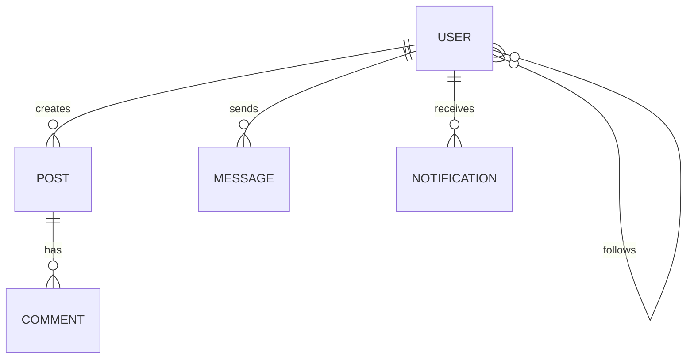

# منصتي (Mansati) — Backend API

> The service layer powering the Mansati Arabic social platform: REST + WebSocket API on Node.js/Express, MongoDB via Mongoose, JWT-based auth, and a Socket.IO real-time channel for chat and notifications.


> **Documentation scope note:** this README is built from the backend project's own high-level documentation, not a full source audit. The source material enumerates architecture layers, a technology list, and 5 representative endpoints — it does not expose Mongoose schemas, individual middleware filenames, specific rate-limit thresholds, or a logging toolchain. Rather than inventing that detail, each affected section below states what's confirmed and what isn't. Endpoints and services not listed in the source are **not** claimed here.

---

## Overview

The Mansati backend is the API and real-time engine behind the [Mansati frontend](https://github.com/mohammed-dev-stack/mansati-frontend) — a Next.js client. It owns persistence (MongoDB), identity (JWT-based auth), and live communication (Socket.IO), and is built around a **layered/clean architecture**: routes hand off to controllers, controllers delegate business logic to services, and services are the only layer that touches the database.

This repository is backend-only. It has no UI concerns; its contract with the outside world is the HTTP API and the WebSocket event surface.

---

## System Architecture



The documented layer responsibilities:

| Layer | Responsibility |
|---|---|
| **Routes** | Define API endpoints, map HTTP verbs/paths to controllers |
| **Middleware** | Authentication/authorization checks, security headers, and centralized error handling |
| **Controllers** | Request/response handling — parse input, call services, shape the response |
| **Services** | Business rules, the only layer documented as talking to the data layer |
| **Models** | Mongoose schemas (database layer — field-level schema not documented in source) |
| **Socket Manager** | WebSocket event handling for chat/notifications, run alongside the controller layer |

---

## API Architecture

The source documents 5 representative endpoints under an `/api` prefix. This is confirmed to be a partial list — the frontend's service layer (`adminService`, `followService`, `messageService`, `notificationService`, `postService`, `userService`) implies a substantially larger surface than what's enumerated here, but this README only documents what's verified.

| Function | Method | Path |
|---|---|---|
| Register a new user | `POST` | `/api/auth/register` |
| Log in | `POST` | `/api/auth/login` |
| Fetch posts | `GET` | `/api/posts` |
| Send a real-time message | `POST` | `/api/messages` |
| Admin dashboard statistics | `GET` | `/api/admin/stats` |

Request flow for a typical authenticated call:



Not documented in source (and therefore not claimed here): request/response body shapes, pagination conventions, versioning strategy, or a complete route inventory.

---

## Authentication Flow



Documented facts:
- **Dual-token JWT model** — separate Access and Refresh tokens.
- **Storage**: both tokens are documented as stored in **HttpOnly cookies** on the backend side.
- **Password hashing**: Bcrypt.js is the documented hashing library for credential storage.

⚠️ **Cross-repo inconsistency worth resolving**: the frontend's own documentation describes token storage two different ways — its features section says HttpOnly cookies (matching this backend doc), but its security section separately states tokens are kept in `sessionStorage` with a cookie fallback. Since token storage is ultimately a backend-issued, frontend-consumed contract, I'd verify the actual `Set-Cookie` behavior in the auth controller against what the frontend's Axios interceptor actually reads before treating either doc as authoritative.

Not documented: token expiry durations, refresh-token rotation/invalidation policy, and whether logout performs server-side token revocation.

---

## Authorization Model

The source confirms role-gated access exists — an admin-only endpoint (`GET /api/admin/stats`) is documented, and the frontend README independently confirms an admin role with a dedicated bootstrap flow (`/admin-login`, first-super-admin creation from env credentials) and role-editing UI for other users.

What is **not** documented in the backend source: the specific role enum/values, how many roles exist beyond "user" and "admin," or the exact middleware implementation used to enforce role checks (e.g., RBAC middleware, per-route guards). Treat "admin vs. standard user" as the confirmed floor, not the full model.

---

## Database Architecture



**Confirmed**: MongoDB, accessed via Mongoose ODM.

**Not confirmed by source** (inferred only from the frontend's documented feature set — shown above as a *plausible* relationship sketch, not a verified schema): exact collection names, field definitions, indexes, or relationships as actually implemented. No `models/` file contents were provided. Treat the diagram above as a hypothesis to validate against the real schema files in `models/`, not as documentation.

---

## Security Architecture

Confirmed, backend-owned security controls:

- **JWT-based authentication** with Access/Refresh tokens in HttpOnly cookies (see Authentication Flow).
- **Password hashing** via Bcrypt.js — plaintext passwords are never persisted.
- **Security headers** via `Helmet.js`, mitigating common HTTP-level vulnerabilities.
- **Rate limiting**, described as protection against DDoS and brute-force attempts (see Rate Limiting below for what is/isn't specified).
- **Data sanitization**, described as protecting against NoSQL injection.
- **CORS configuration**, managed in `config/` per the documented folder structure.
- **Centralized error handling**, isolating internal error detail from client-facing responses (see Error Handling Strategy).

Not documented: CSP policy specifics, dependency-audit/SCA tooling, secrets-management approach beyond `.env`, or a documented threat model.

---

## Validation Layer

The source confirms **data sanitization** exists (framed as NoSQL-injection prevention) but does not name a specific validation library (e.g., Joi, Zod, express-validator) or show validation schema definitions. Given the documented folder structure, request validation most plausibly lives in the `middleware/` layer ahead of controllers, but this placement is an architectural inference from the layering diagram, not a confirmed file-level detail.

---

## Error Handling Strategy

- **Global error handling** is explicitly documented as a design goal — "معالجة مركزية للأخطاء لضمان استقرار الخادم" (centralized error handling to ensure server stability) — implemented as Express error-handling middleware per the architecture diagram (Middleware layer sits between routes and controllers, and is the natural home for this in an Express app).
- Not documented: the response error-shape/contract (error codes, message format), whether errors are classified (operational vs. programmer errors), or whether uncaught exceptions/promise rejections have process-level handlers.

---

## Logging Strategy

Not documented in source. No logging library (e.g., Winston, Pino), log destination, or log-level strategy is specified. This is a gap to close before treating the service as production-observable — see Future Improvements.

---

## Rate Limiting

Confirmed to exist, described as protection against DDoS and brute-force attacks. Not documented: which library implements it (e.g., `express-rate-limit`), which routes it applies to (all routes vs. auth-specific), request thresholds, or window durations.

---

## Performance Considerations

Documented performance-relevant capabilities:
- **Multer**-based file/image upload handling, implying request-level file-size/type constraints are at least a natural extension point (not confirmed as implemented).
- **Socket.IO** for real-time features, avoiding polling-based chat/notification delivery.
- **Layered architecture** itself is a performance-relevant choice insofar as it keeps controllers thin and business logic isolated, making targeted optimization (e.g., caching at the service layer) tractable later without restructuring.

Not documented: caching layer (Redis or otherwise), database indexing strategy, connection pooling configuration, or load-testing results.

---

## Scalability Considerations

Not directly documented in source. Based on the confirmed stack (stateless-friendly JWT auth, MongoDB, Socket.IO), the architecture is *compatible* with horizontal scaling, but this backend's source material does not confirm: a Socket.IO adapter for multi-instance pub/sub (e.g., Redis adapter — required for WebSocket scaling beyond a single process), containerization, or a process manager (PM2, etc.). These are flagged as open questions rather than assumed capabilities.

---

## Folder Structure

```
backend/
├── config/             # Database connection & CORS configuration
├── controllers/        # Request-handling logic per route
├── middleware/         # Auth, authorization, and error-handling middleware
├── models/             # Mongoose schema definitions
├── routes/             # API endpoint definitions
├── socket/             # WebSocket event management (Socket.IO)
├── utils/              # Helper functions
├── .env.example        # Required environment variable template
└── server.js           # Application entry point
```

---

## Environment Variables

The source confirms a `.env.example` exists as the template for required configuration and explicitly calls out a MongoDB connection string as required. Beyond that, individual variable names are not enumerated in the provided documentation — consult `.env.example` directly in the repository for the authoritative list (e.g., it will need, at minimum, a Mongo URI, JWT signing secrets, and a port/CORS origin, but this README does not assert specific variable names it hasn't seen).

---

## Installation

**Prerequisites**: Node.js LTS (20+), a reachable MongoDB instance.

```bash
git clone https://github.com/mohammed-dev-stack/mansati-backend.git
cd mansati-backend
npm install
```

Create `.env` from `.env.example` and set your MongoDB connection string (and any other variables `.env.example` specifies).

---

## Development Workflow

```bash
npm run dev
```

Starts the server in development mode. The companion frontend expects this service reachable at `http://localhost:5000` by default (per the frontend's own `.env.local` configuration), so keep the port aligned across both repos during local development.

---

## Deployment

Not documented in source — no Dockerfile, CI/CD pipeline, or hosting target (e.g., Render, Railway, a VPS) is specified. Given the stack (Node/Express + MongoDB + Socket.IO), any deployment target needs: a persistent Node process (not a serverless function, due to the stateful WebSocket connections), a reachable MongoDB instance (Atlas or self-hosted), and CORS/env configuration pointed at the deployed frontend origin. Document the actual target once confirmed.

---

## Monitoring Considerations

Not documented in source. No APM, health-check endpoint, or uptime-monitoring integration is specified. A `/health` or `/api/status` endpoint and basic process metrics would be a reasonable near-term addition — see Future Improvements.

---

## Future Improvements

Inferred as reasonable next steps given the documented gaps above (not claims about a stated roadmap, since the source doesn't provide one for the backend specifically):

- [ ] Publish full API documentation (OpenAPI/Swagger) covering the complete route set beyond the 5 representative endpoints shown here.
- [ ] Document Mongoose schemas and their relationships.
- [ ] Add a structured logging layer (e.g., Winston/Pino) with log levels and a shipping destination.
- [ ] Add a `/health` endpoint and basic process/DB-connection monitoring.
- [ ] Document rate-limit thresholds and confirm coverage (all routes vs. auth-only).
- [ ] Add a Redis-backed Socket.IO adapter if/when scaling beyond a single instance.
- [ ] Add automated tests (unit + integration) and a CI pipeline.
- [ ] Resolve the token-storage documentation mismatch with the frontend repo (HttpOnly cookie vs. sessionStorage).

---

## Author

**Mohammed Qannan**
Full-Stack Developer — TypeScript & Next.js specialist, backend built around Node.js/Express and MongoDB with a layered-architecture discipline.

---

## License

MIT — see `LICENSE` for full terms.