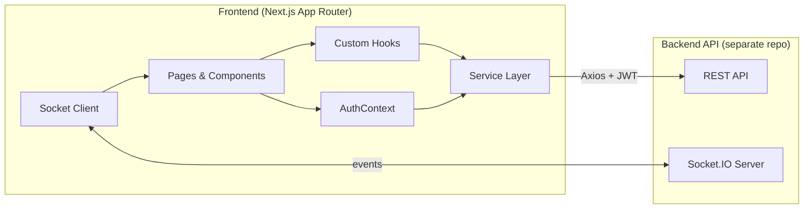
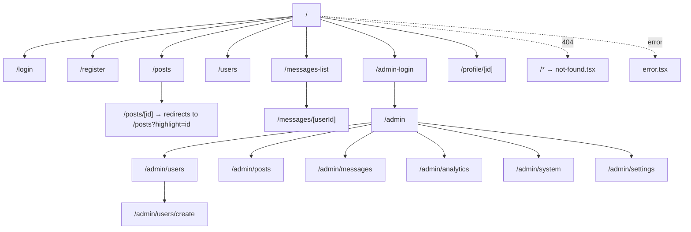
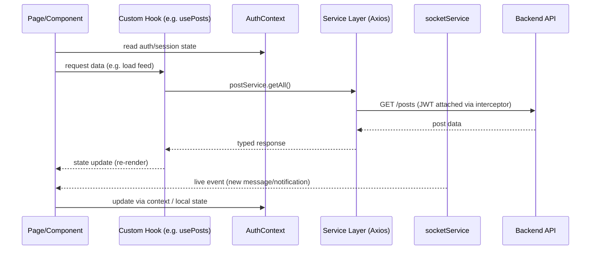
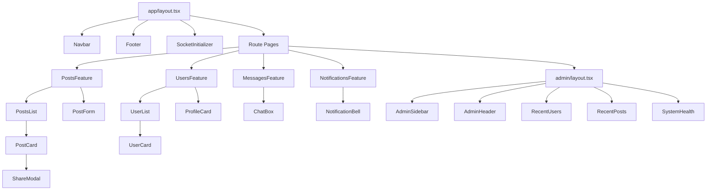

# منصتي (Mansati) — Frontend

> An Arabic-first social platform frontend built with Next.js 15 (App Router), React 19, and TypeScript — real-time messaging, notifications, and a full admin console, with RTL as a first-class layout direction rather than an afterthought.


This repository is the **frontend application only**. It is a Next.js client that talks to a separate backend API (default `http://localhost:5000`) over REST (via Axios) and WebSocket (via Socket.IO) for real-time features.

---

## Project Overview

منصتي is a social networking client for Arabic-speaking users, covering the standard social-app surface — auth, profiles, a following graph, a post feed with seven reaction types, comments, sharing, private messaging, and live notifications — plus a separate, fully-routed admin console for platform operators (user/post/message moderation, analytics, and system-health monitoring).

The frontend's job is deliberately narrow and well-defined: own the UI/UX, own client-side routing and auth-gated navigation, own real-time event handling on the client, and talk to the backend through a typed service layer. It does not own persistence, business rules enforcement, or password hashing — those live in the backend.

Two user populations are served by two route trees:
- **Standard users** — feed, profile, messaging, notifications, user discovery.
- **Admins** — a parallel `/admin/*` route tree with its own layout, sidebar/header shell, and moderation/analytics screens.

---

## Architecture Overview



The client is structured in four layers:

1. **Presentation** — App Router pages and route-group layouts (`(auth)`, `admin`, top-level app shell).
2. **State/Context** — `AuthContext` for session state, plus feature hooks (`useAuth`, `usePosts`, `useProfile`) that encapsulate data-fetching and local UI state per feature.
3. **Service layer** — one service module per domain (`postService`, `messageService`, `followService`, `notificationService`, `adminService`, `userService`, `socketService`), all funneled through a shared `api.ts` Axios instance with interceptors for token attachment and refresh.
4. **Real-time layer** — a dedicated `socketService` plus a `SocketInitializer` component that establishes the WebSocket connection once at app bootstrap and feeds live events (messages, notifications, presence) back into the UI.

---

## UI Architecture

- Built on the **Next.js App Router**, using route groups to separate concerns: `(auth)` for unauthenticated flows, `admin/` for the operator console, and top-level feature directories (`posts`, `messages`, `profile`, `users`) for the main app.
- **RTL and Arabic support** are treated as core layout requirements, not a locale toggle bolted on afterward — the entire component set (Navbar, Footer, cards, modals, chat UI) is designed direction-aware.
- **CSS Modules** scope styles per component to avoid bleed between features, backed by two global stylesheets (`globals.css`, `variables.css`) for shared tokens.
- Dedicated **admin shell** (`AdminSidebar`, `AdminHeader`) is decoupled from the standard-user `Navbar`/`Footer`, so the two experiences can evolve independently.
- Dedicated `error.tsx` and `not-found.tsx` at the app root provide app-wide error and 404 boundaries within the App Router's built-in error-boundary convention.

---

## Routing Architecture



Notable routing decisions documented in the codebase:

- `/posts/[id]` is **not** a standalone post detail page — it's a redirect target that forwards to `/posts?highlight=[id]`, where `PostsList` scrolls to and visually highlights the target post using a `ref`. This keeps a single feed implementation as the source of truth instead of duplicating post-rendering logic across two routes.
- `/admin-login` is a distinct, purpose-built route for bootstrapping the **first** admin account from super-admin credentials in the environment file — it is not the general admin sign-in route.
- Admin routes live under their own `admin/layout.tsx`, isolating the admin shell (sidebar/header) from the consumer-facing layout.

---

## State Management Architecture



State is intentionally kept lightweight rather than routed through a global store:

- **`AuthContext`** (React Context) owns session/identity state and is the single source of truth for "who is logged in and what's their role."
- **Custom hooks** (`useAuth`, `usePosts`, `useProfile`) wrap each feature's data access and local UI state, so components stay declarative and don't talk to `services/` directly.
- **Local component state** (`useState`) handles ephemeral UI concerns (modal open/closed, form inputs, typing indicators).
- **`localStorage`** is used as a caching layer for user/post data with an update strategy to avoid redundant refetches; session tokens are handled separately (see Security).
- **Real-time state** flows in via `socketService`/`SocketInitializer`, which pushes WebSocket events (new messages, notifications, presence/typing state) into the relevant hooks/components rather than requiring polling.

There is no Redux/Zustand/Recoil layer documented — state management is Context + hooks + service layer, which keeps the mental model small at this app's current scope.

---

## Component Architecture



Components are organized **by feature domain**, not by atomic-design tier — `components/posts`, `components/users`, `components/messages`, `components/notifications`, `components/admin`, `components/layout`. Each domain folder is self-contained: a card/list/form pattern repeats across `posts` and `users`, giving the codebase a predictable shape to onboard into.

Two components worth calling out for their design intent:
- **`ShareModal`** — decouples the act of sharing (copy link vs. send-to-user-via-DM) from `PostCard`, so `PostCard` doesn't need to know about messaging internals.
- **`PostsList`** — owns the highlight/scroll-to-post behavior needed by the `/posts/[id]` redirect pattern, keeping that logic out of the page component.

Performance-oriented patterns applied at the component level: `React.lazy` + `Suspense` for progressive loading, and `useCallback`/`useMemo`/`memo` to limit re-renders on list-heavy views (feed, user lists, chat).

---

## Design System

- **Styling approach**: CSS Modules per component, with two shared stylesheets (`styles/globals.css`, `styles/variables.css`) acting as the design-token layer (colors, spacing, typography primitives referenced across modules).
- **Iconography**: a deliberate mix of React Icons and Font Awesome rather than a single icon set — chosen per-context in the documented component set.
- **Data visualization**: Recharts powers the admin analytics screens (daily activity, content distribution, user growth), configurable by time range.
- **Direction-awareness**: RTL/Arabic typography and layout are baked into the shared stylesheet layer rather than handled per-component, so new components inherit correct direction behavior by default.
- **Admin theming**: the settings screen exposes an "appearance" section (platform colors, site logo) as a documented, if not yet independently verified in code, customization surface.

---

## Accessibility Strategy

Accessibility is currently **best-effort, not yet systematized** — the codebase does not document a formal a11y implementation (no ARIA audit, no documented keyboard-navigation pass, no automated a11y testing). This is explicitly called out in the project's own roadmap rather than claimed as complete:

- ARIA labeling and keyboard-navigation improvements are a **planned** workstream, not a shipped one.
- Semantic HTML and Next.js's built-in accessibility affordances (e.g., `next/image` alt handling, semantic routing) are the current baseline.

Teams adopting this codebase should treat a11y as a near-term hardening item rather than an assumed guarantee — see Future Improvements.

---

## Error Handling Strategy

- **App-level boundaries**: `app/error.tsx` and `app/not-found.tsx` provide the App Router's standard error and 404 boundaries, giving every route a fallback instead of a blank/broken screen.
- **Service-layer handling**: all HTTP calls are centralized through `services/api.ts`, which is where token attachment, error normalization, and refresh-on-expiry logic live — keeping try/catch noise out of components (see the `postService.create` usage example below).
- **Confirmation-gated destructive actions**: bulk/individual delete actions in the admin console (users, posts, messages) are routed through confirmation dialogs before mutation, reducing accidental data loss from moderation actions.
- **Form/input validation feedback**: registration and admin-creation flows surface field-level validation messaging rather than failing silently.

```typescript
import postService from '@/services/postService';

const handleCreatePost = async (formData: FormData) => {
  try {
    const newPost = await postService.create(formData);
    console.log('Post created:', newPost);
  } catch (error) {
    console.error('Failed to create post:', error);
  }
};
```

---

## Performance Optimizations

- **Code-splitting**: `React.lazy` + `Suspense` for progressive component loading.
- **Render minimization**: `useCallback`, `useMemo`, and `memo` applied on list-heavy, frequently-updating views.
- **Client-side caching**: user/post data cached in `localStorage` with an update strategy to reduce redundant network calls.
- **Image handling**: `next/image` for automatic optimization, resolved against full backend URLs via a `sanitizeImageUrl` utility.
- **Resilient real-time connection**: the Socket.IO client reconnects automatically on network interruption rather than requiring a manual refresh.

---

## Security Considerations

Scoped to what the **frontend** is responsible for (backend concerns — password hashing, rate limiting, CORS policy, HTTP security headers — live in the separate backend repo and are out of scope here):

- **Session handling**: auth tokens are stored client-side (documented as `sessionStorage`, with an HttpOnly-cookie path supported by the backend) and are attached to outgoing requests via an Axios interceptor in `services/api.ts`, which also handles proactive token refresh before expiry.
- **Route protection**: protected routes (e.g., `/admin/*`) are gated by middleware/role checks before rendering, rather than relying on the backend alone to reject unauthorized reads.
- **Input sanitization**: a shared `sanitizeInput` utility is applied to user-submitted content on the client as a defense-in-depth measure.
- **Safe media URLs**: `sanitizeImageUrl` constrains how uploaded/user-referenced image URLs are constructed before rendering.
- **Authenticated WebSocket**: the Socket.IO client sends the auth token with the connection handshake, so real-time channels are subject to the same identity checks as REST calls.

---

## Folder Structure

```
frontend/
├── public/                          # Static assets (default avatars, icons)
├── src/
│   ├── app/                         # Next.js App Router
│   │   ├── (auth)/                  # login, register, admin-login
│   │   ├── admin/                   # Admin console (own layout)
│   │   │   ├── analytics/
│   │   │   ├── messages/
│   │   │   ├── posts/
│   │   │   ├── settings/
│   │   │   ├── system/
│   │   │   ├── users/
│   │   │   │   └── create/
│   │   │   └── layout.tsx
│   │   ├── messages/
│   │   │   └── [userId]/
│   │   ├── posts/
│   │   │   └── [id]/                # Redirects to /posts?highlight=id
│   │   ├── profile/[id]/
│   │   ├── users/
│   │   ├── error.tsx
│   │   ├── layout.tsx
│   │   └── not-found.tsx
│   ├── components/
│   │   ├── admin/                   # AdminHeader, AdminSidebar, SystemHealth, ...
│   │   ├── layout/                  # Navbar, Footer
│   │   ├── messages/                # ChatBox
│   │   ├── notifications/           # NotificationBell
│   │   ├── posts/                   # PostCard, PostForm, PostsList, ShareModal
│   │   ├── users/                   # ProfileCard, UserCard, UserList
│   │   └── SocketInitializer.tsx
│   ├── context/
│   │   └── AuthContext.tsx
│   ├── hooks/
│   │   ├── useAuth.ts
│   │   ├── usePosts.ts
│   │   └── useProfile.ts
│   ├── services/
│   │   ├── api.ts                   # Axios instance + interceptors
│   │   ├── adminService.ts
│   │   ├── followService.ts
│   │   ├── messageService.ts
│   │   ├── notificationService.ts
│   │   ├── postService.ts
│   │   ├── socketService.ts
│   │   └── userService.ts
│   ├── types/                       # Admin, Message, Notification, Post, User
│   ├── utils/                       # constants, formatDate, security
│   └── styles/                      # globals.css, variables.css
├── .env.local
├── next.config.js
└── package.json
```

---

## Technology Stack

| Layer | Technology | Purpose |
|---|---|---|
| Framework | Next.js 15.2 (App Router) | Routing, SSR, build pipeline |
| UI | React 19 | Component model |
| Language | TypeScript 5 | Type safety |
| Styling | CSS Modules | Scoped component styling |
| Real-time | Socket.IO Client 4.7 | Live messages/notifications |
| HTTP | Axios (with interceptors) | REST communication, token lifecycle |
| Charts | Recharts | Admin analytics visualizations |
| Icons | React Icons, Font Awesome | UI iconography |
| Dates | date-fns | Arabic-friendly date/time formatting |
| Auth utils | jwt-decode | Client-side token inspection |
| Tooling | ESLint, Prettier | Code quality/consistency |

---

## Installation

**Prerequisites**: Node.js v20+, npm/yarn/pnpm, and a running backend on `http://localhost:5000` (separate repository).

```bash
git clone https://github.com/bzbsndndjnd/mansati-frontend.git
cd mansati-frontend
npm install
```

Create `.env.local` in the project root:

```env
NEXT_PUBLIC_API_URL=http://localhost:5000
NEXT_PUBLIC_SOCKET_URL=http://localhost:5000
NEXT_PUBLIC_ADMIN_USER=admin
NEXT_PUBLIC_ADMIN_PASS=123456
NEXT_PUBLIC_ADMIN_EMAIL=admin@example.com
```

> These `NEXT_PUBLIC_ADMIN_*` values are used only to bootstrap the *first* super-admin via `/admin-login` — rotate them before any non-local deployment.

---

## Development Workflow

```bash
npm run dev
```

Starts the Next.js dev server at `http://localhost:3000`. The app expects the backend (REST + Socket.IO) to already be running at the URL configured in `.env.local`; without it, auth, feed, and real-time features will fail against a live network call.

Code style is enforced via ESLint + Prettier; contributions are expected to match the existing feature-folder component pattern (see Component Architecture) rather than introducing new organizational conventions ad hoc.

---

## Build Process

```bash
npm run build
npm start
```

`next build` produces an optimized production build (SSR/route optimization, image optimization pipeline); `next start` serves it. No custom build steps beyond the standard Next.js pipeline are documented.

---

## Deployment

The project's live preview is hosted on **Vercel** (`mansati-frontend-*.vercel.app`), which is a natural fit for a Next.js App Router project — automatic build/deploy on push, edge-optimized asset delivery, and zero-config SSR support. Any deployment target needs the same two environment variables (`NEXT_PUBLIC_API_URL`, `NEXT_PUBLIC_SOCKET_URL`) pointed at a reachable backend instance, plus rotated admin bootstrap credentials.

---

## Future Improvements

- [ ] Groups — public/private groups with membership and in-group posts.
- [ ] Advanced search (by date, media type, engagement).
- [ ] Web Push API for desktop notifications.
- [ ] Dark mode with persisted user preference.
- [ ] WebP image pipeline via `next/image`.
- [ ] Automated testing — unit (Jest) and integration (Cypress).
- [ ] Component documentation via Storybook.
- [ ] Formal accessibility pass — ARIA labeling, keyboard navigation.
- [ ] Live streaming via WebRTC.
- [ ] Hashtag system for content discovery/classification.

---

## Author

**Mohammed Qannan**
Frontend Developer specializing in React, Next.js, and TypeScript, with a focus on UI architecture, performance, and integrating real-time systems into product-facing interfaces.

- Email: [m.qannan@example.com](mailto:m.qannan@example.com)
- LinkedIn: [linkedin.com/in/mqannan](https://linkedin.com/in/mqannan)
- GitHub: [github.com/mqannan](https://github.com/mqannan)

---

## License

MIT — see `LICENSE` for full terms.